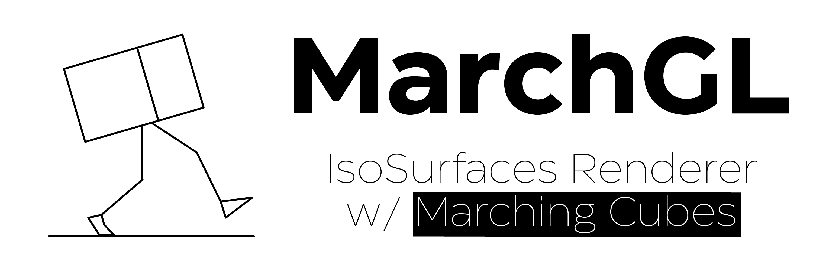
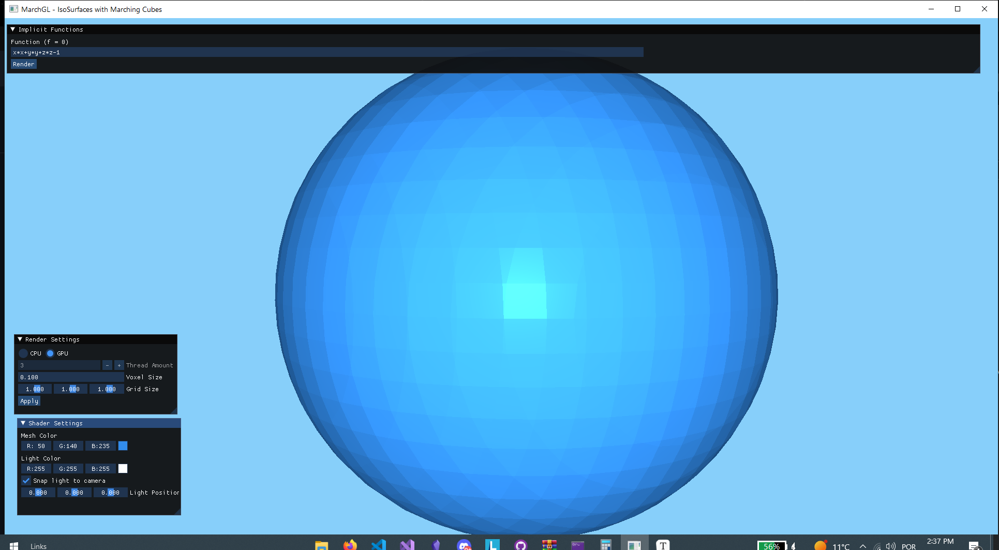
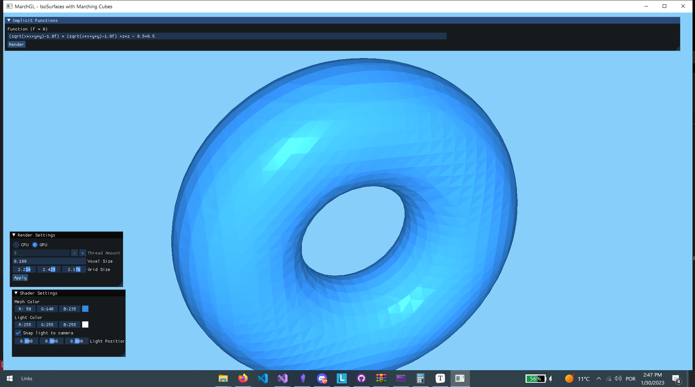

<!--
*** Thanks for checking out the Best-README-Template. If you have a suggestion
*** that would make this better, please fork the repo and create a pull request
*** or simply open an issue with the tag "enhancement".
*** Don't forget to give the project a star!
*** Thanks again! Now go create something AMAZING! :D
-->

<!-- PROJECT SHIELDS -->
<!--
*** I'm using markdown "reference style" links for readability.
*** Reference links are enclosed in brackets [ ] instead of parentheses ( ).
*** See the bottom of this document for the declaration of the reference variables
*** for contributors-url, forks-url, etc. This is an optional, concise syntax you may use.
*** https://www.markdownguide.org/basic-syntax/#reference-style-links
-->

[![Contributors][contributors-shield]][contributors-url]
[![Forks][forks-shield]][forks-url]
[![Stargazers][stars-shield]][stars-url]
[![Issues][issues-shield]][issues-url]
[![MIT License][license-shield]][license-url]
[![LinkedIn][linkedin-shield]][linkedin-url]

 

    
    <h3 align="center">MarchGL</h3>
    

        A IsoSurface renderer using Marching Cubes on Modern OpenGL
         
         
        <a href="https://github.com/AshKetshup/MarchGL">View Demo</a>
        ·
        <a href="https://github.com/AshKetshup/MarchGL/issues">Report Bug</a>
        ·
        <a href="https://github.com/AshKetshup/MarchGL/issues">Request Feature</a>
    

<!-- ABOUT THE PROJECT -->
## About The Project

(<a href="#top">back to top</a>)

### Built With

* [C++ 20](https://cplusplus.com/)
* [GLFW 3.3.8](https://www.glfw.org/)
* [GLAD](https://glad.dav1d.de/)
* [GLM 0.9.9.8](https://github.com/g-truc/glm)
* [CParse](https://github.com/cparse/cparse)
* [Dear ImGui v1.89.2](https://github.com/ocornut/imgui)

(<a href="#top">back to top</a>)

## Change log

- GPU (Compute Shaders) now available 
- Limitations:
  - When voxel size < 0.1 it may not work (memory allocation problems)
- All Marching Cubes algorithm is inside "MarchGL/MarchGL/src/cubeMarch.cpp"
- Compute shader is inside "MarchGL/MarchGL/res/src" (file name: "computeShaderOriginal.cs")

<!-- USAGE EXAMPLES -->
## Usage

1. Apply desired settings in the "Render Settings" window
2. Introduce implicit formula in the "Implicit Functions" window, and then render 
   - f.e Sphere formula: x\*x + y\*y + z\*z - radius\*radius (replace radius for desired value)

## MarchGL - Algorithm

Iso-Surfaces using Marching Cubes in Modern OpenGL

- All 15 unique possible cases:

- Black: vertices numbers
- Red: edges numbers

## Example

- Case 1: (only vertice 0 is inside the shape)
	- Decimal
		- Vertice: 0
		- Edges: 048 (lookup in first table)
	- Binary
		- Vertice: 0000 0001
		- Edges: 0000 0000 1100
	  1. Calculate the points of each edge (Linear Interpolation)
	     - Formula: (1-t) * p1 + t * p2, t = -D1/(D2-D1); D -> density on the point
	  2. Add those vertices to a list
	  3. "Organize" the vertices, in a way that the correct triangles are drawn (lookup third table, using the vertice binary)

<!-- CONTACT -->
## Contact

Diogo Simões - dsimoes2000@gmail.com

Project Link: [https://github.com/AshKetshup/Landmark](https://github.com/AshKetshup/Landmark)

(<a href="#top">back to top</a>)

<!-- ACKNOWLEDGMENTS 
## Acknowledgments

* 
* 
* 
-->

(<a href="#top">back to top</a>)

<!-- MARKDOWN LINKS & IMAGES -->
<!-- https://www.markdownguide.org/basic-syntax/#reference-style-links -->
[contributors-shield]: https://img.shields.io/github/contributors/AshKetshup/MarchGL.svg?style=for-the-badge
[contributors-url]: https://github.com/AshKetshup/MarchGL/graphs/contributors
[forks-shield]: https://img.shields.io/github/forks/AshKetshup/MarchGL.svg?style=for-the-badge
[forks-url]: https://github.com/AshKetshup/MarchGL/network/members
[stars-shield]: https://img.shields.io/github/stars/AshKetshup/MarchGL.svg?style=for-the-badge
[stars-url]: https://github.com/AshKetshup/MarchGL/stargazers
[issues-shield]: https://img.shields.io/github/issues/AshKetshup/MarchGL.svg?style=for-the-badge
[issues-url]: https://github.com/AshKetshup/MarchGL/issues
[license-shield]: https://img.shields.io/github/license/AshKetshup/MarchGL.svg?style=for-the-badge
[license-url]: https://github.com/AshKetshup/MarchGL/blob/TheMainTimeline/LICENSE.txt
[linkedin-shield]: https://img.shields.io/badge/-LinkedIn-black.svg?style=for-the-badge&logo=linkedin&colorB=555
[linkedin-url]: https://linkedin.com/in/diogo-simoes-8b5a0618a
